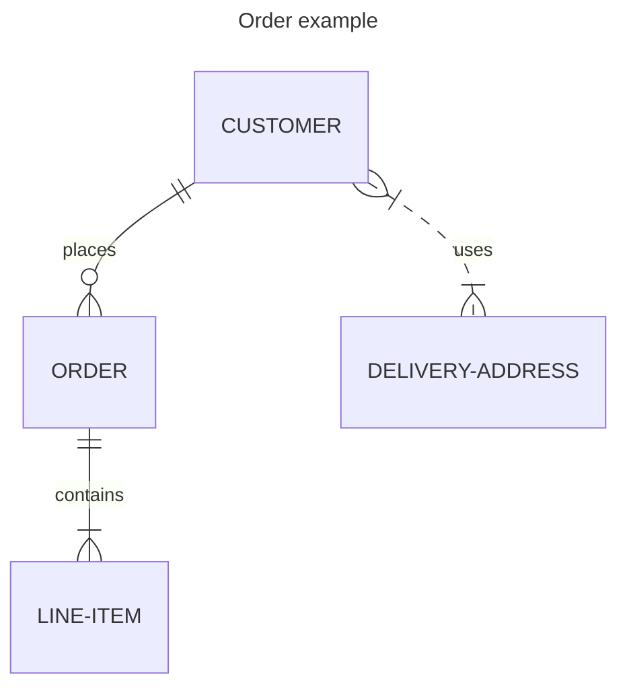
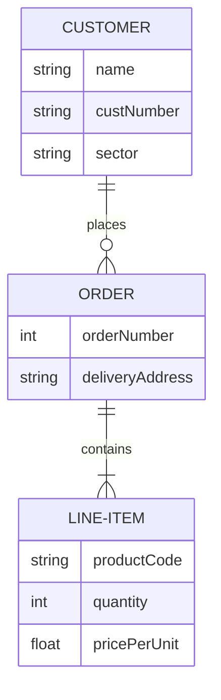
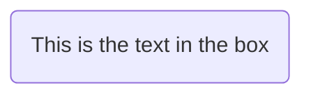
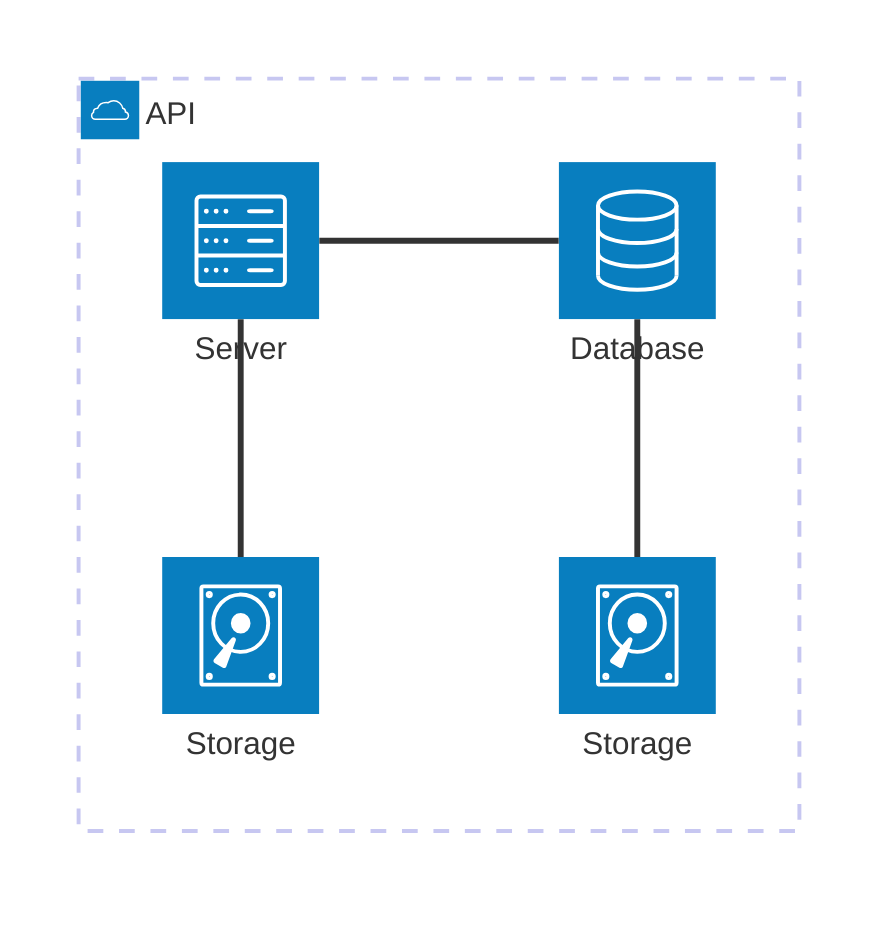
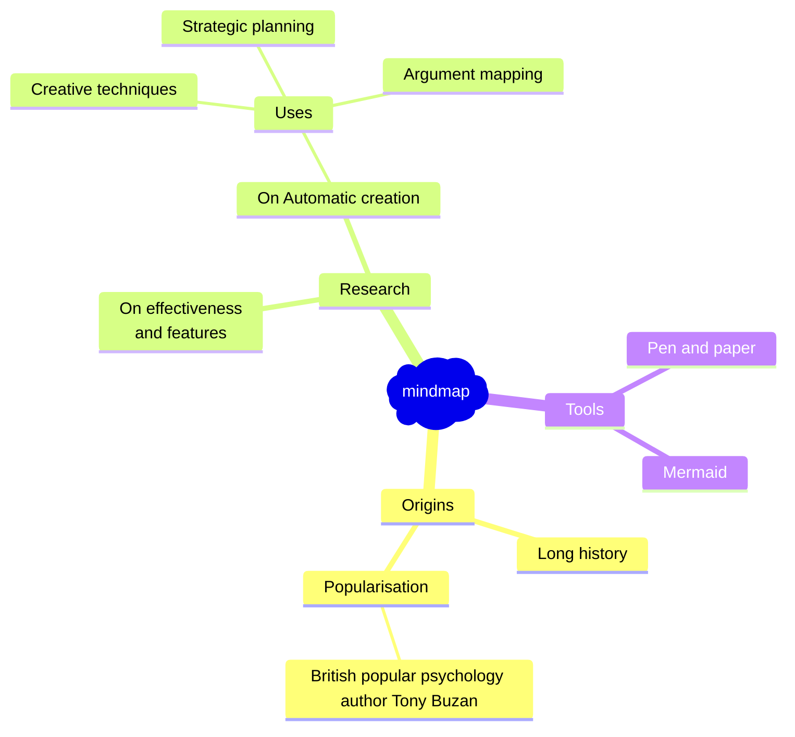

# 🧜‍♀️ Mermaid JS

We can use [Mermaid](https://mermaid.js.org/) diagrams 

## [ERD](https://mermaid.js.org/syntax/entityRelationshipDiagram.html)




<details>
<summary>Code</summary>
<div>

````jsx

````
</div>
</details>




<details>
<summary>Code</summary>
<div>

````jsx

````
</div>
</details>

## Graph


<details>
<summary>Code</summary>
<div>

````jsx

````
</div>
</details>

## [A node with round edges](https://mermaid.js.org/syntax/flowchart.html#a-node-with-round-edges)



<details>
<summary>Code</summary>
<div>

````jsx
flowchart LR
    id1(This is the text in the box)
```
````
</div>
</details>

## Architecture Diagrams



<details>
<summary>Code</summary>
<div>

````jsx

````
</div>
</details>

## Mind maps




<details>
<summary>Code</summary>
<div>

````jsx

````
</div>
</details>